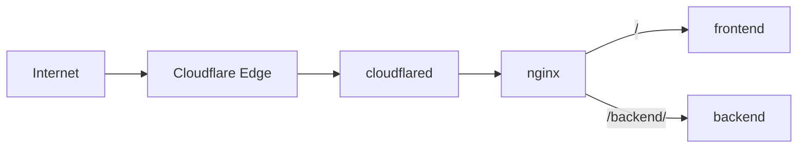

# Cloudflare Tunnel Docker Demo

A small Docker Compose demo that exposes frontend and backend containers through Cloudflare Tunnel and nginx—without opening a host port.



## Requirements

- Docker, Docker Compose, and Make
- A Cloudflare account with a domain managed by Cloudflare

## Quick start

### 1. Create the tunnel

In the [Cloudflare dashboard](https://dash.cloudflare.com), go to **Networking → Tunnels → Create tunnel**. After creating it:

- **Overview → Add a replica** (OS: **Docker**): copy the `eyJ...` token.
- Go to **Networking → Tunnels → select your tunnel → Routes → Add route → Published application**. Choose a hostname and set **Service URL** to `http://nginx:80`.

Cloudflare automatically creates a DNS record similar to:

```text
Type:      CNAME
Name:      demo.example.com
Points to: <TUNNEL-UUID>.cfargotunnel.com
```

### 2. Run the demo

```bash
make setup
```

Paste the token into `.env`:

```dotenv
CLOUDFLARE_TUNNEL_TOKEN=eyJ...
```

Then run:

```bash
make up
```

### 3. Open the hostname

Wait for the tunnel to show **Healthy**, then visit the hostname. If needed, run `make logs`.

## Optional: protect it with an email PIN

1. Enable **One-time PIN** at **Zero Trust → Integrations → Identity providers**.
2. At **Access controls → Applications**, create a **Self-hosted and private** application for the same hostname.
3. Add this **Allow** policy and save:

```text
Name:    Allowed visitors
Action:  Allow
Include: Emails → friend@example.com
Require: Login Methods → One-time PIN
```

Replace the email and keep an allowlist. See the [Tunnel](https://developers.cloudflare.com/cloudflare-one/networks/connectors/cloudflare-tunnel/get-started/create-remote-tunnel/) and [One-time PIN](https://developers.cloudflare.com/cloudflare-one/integrations/identity-providers/one-time-pin/) guides.

> Permissions: account owner, or **Cloudflare Access** + **DNS** + **Load Balancer**.

## Routing

| Path | Result |
|------|--------|
| `/` | Frontend |
| `/backend` | Redirect to `/backend/` |
| `/backend/*` | Backend (prefix removed) |

## Customize

Replace the `frontend` or `backend` service image in `docker-compose.yml`, then edit routing in `nginx/nginx.conf`. Run `make help` for all commands.
