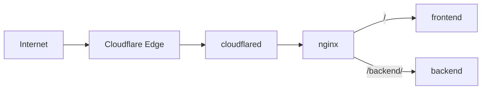

# Cloudflare Tunnel Docker Demo

A small Docker Compose demo that exposes frontend and backend containers through Cloudflare Tunnel and nginx—without opening a host port.



## Requirements

- Docker, Docker Compose, and Make
- A Cloudflare account with a domain managed by Cloudflare

## Setup

### 1. Create a tunnel

In the [Cloudflare dashboard](https://dash.cloudflare.com), go to **Networking → Tunnels → Create tunnel**, enter a name, and select **Create**.

### 2. Copy the token

Open the tunnel's **Overview** tab and select **Add a replica**. Cloudflare shows a command containing `--token eyJ...`; copy only the `eyJ...` value.

### 3. Add a public hostname

Open **Routes → Add route → Published application** and enter:

- **Hostname:** your Cloudflare-managed domain or subdomain
- **Service URL:** `http://nginx:80`

### 4. Configure the demo

```bash
make setup
```

Open `.env` and paste the token:

```dotenv
CLOUDFLARE_TUNNEL_TOKEN=eyJ...
```

Then start the containers:

```bash
make up
```

The tunnel should become **Healthy** in Cloudflare, and the hostname should show the demo page. Use `make logs` if it does not connect. On a restricted network, allow outbound port `7844`.

### Cloudflare permissions

Account owners already have access. For another member, grant the least scope possible:

- **Cloudflare Access** to create and configure tunnels.
- **DNS** and **Load Balancer** to publish a public hostname.
- When possible, scope access to the required account, domain, or individual tunnel.

See Cloudflare's [tunnel setup](https://developers.cloudflare.com/cloudflare-one/networks/connectors/cloudflare-tunnel/get-started/create-remote-tunnel/) and [permission reference](https://developers.cloudflare.com/cloudflare-one/networks/connectors/cloudflare-tunnel/configure-tunnels/remote-tunnel-permissions/).

### Protect the demo with One-time PIN

1. Go to **Zero Trust → Integrations → Identity providers → Add new identity provider**, then select **One-time PIN**.
2. Go to **Access controls → Applications**, add a **Self-hosted** application, and enter the same hostname used by the tunnel.
3. Add an **Allow** policy that includes only specific email addresses or trusted email domains, then select **One-time PIN** as the login method.
4. Open the hostname and verify an allowed user receives and can use the emailed code.

Do not allow **One-time PIN** by itself—without an email allowlist, any valid email address could gain access. See Cloudflare's [One-time PIN guide](https://developers.cloudflare.com/cloudflare-one/integrations/identity-providers/one-time-pin/).

## Routing

| Path | Service |
|------|---------|
| `/` | Static frontend demo |
| `/backend/` | Placeholder backend container |

`/backend` redirects to `/backend/`. Follow logs with `make logs` and stop everything with `make down`.

## Customize

Replace the `frontend` or `backend` service image in `docker-compose.yml`, then edit routing in `nginx/nginx.conf`. Run `make help` for all commands.

> This is a demo. For production, add Cloudflare Access, managed secrets, monitoring, and a tested image-update process.
