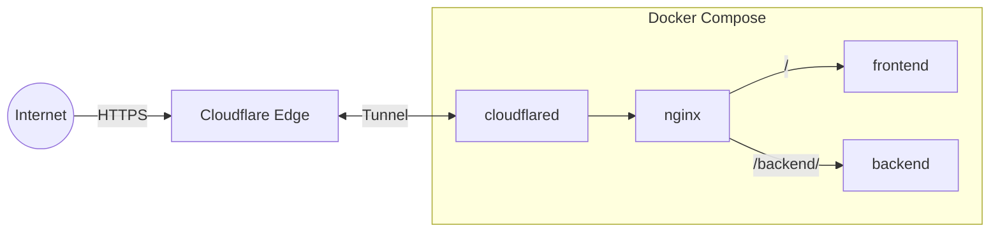

# Cloudflare Tunnel — Docker Compose

Exposes local Docker services to the internet through a Cloudflare Tunnel, with nginx routing traffic to a frontend and backend container.



## Requirements

- Docker and Docker Compose
- A Cloudflare account with Zero Trust enabled

## Setup

1. Create a tunnel at [Cloudflare Zero Trust](https://one.dash.cloudflare.com) → Networks → Tunnels
2. Set the public hostname service to `http://nginx:80`
3. Copy the tunnel token

```bash
cp .env.example .env   # paste the token inside
docker compose up -d
```

## Routing

| Path | Service |
|------|---------|
| `/` | frontend |
| `/backend/` | backend |

Routes are defined in [nginx/nginx.conf](nginx/nginx.conf).

## Services

`frontend` and `backend` currently point at placeholder `nginx:alpine` images in [docker-compose.yml](docker-compose.yml). Swap in your own image, or uncomment the `build:` block to build from a local `./frontend` or `./backend` directory.

## Notes

- `.env` holds your tunnel token and is gitignored — never commit it.
