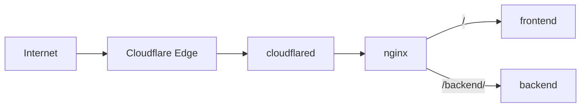

# Cloudflare Tunnel Docker Demo

A small Docker Compose demo that exposes frontend and backend containers through Cloudflare Tunnel and nginx—without opening a host port.



## Requirements

- Docker, Docker Compose, and Make
- A Cloudflare account with a domain managed by Cloudflare

## Quick start

### 1. Create the tunnel

In the [Cloudflare dashboard](https://dash.cloudflare.com), open **Networking → Tunnels → Create tunnel**. Inside the new tunnel:

- **Overview → Add a replica:** copy only the `eyJ...` token.
- **Routes → Add route → Published application:** choose a hostname and set **Service URL** to `http://nginx:80`.

### 2. Run the demo

```bash
make setup
```

Paste the token into `.env`:

```dotenv
CLOUDFLARE_TUNNEL_TOKEN=eyJ...
```

Then run:

```bash
make up
```

### 3. Open the hostname

Wait for the tunnel to show **Healthy**, then visit the hostname. If needed, run `make logs`.

## Optional: protect it with an email PIN

1. Enable **One-time PIN** at **Zero Trust → Integrations → Identity providers**.
2. At **Access controls → Applications**, create a **Self-hosted and private** application for the same hostname.
3. Add this **Allow** policy and save:

```text
Name:    Allowed visitors
Action:  Allow
Include: Emails → friend@example.com
Require: Login Methods → One-time PIN
```

Replace the example email with your visitor's address. Do not allow One-time PIN without an email allowlist. See Cloudflare's [tunnel](https://developers.cloudflare.com/cloudflare-one/networks/connectors/cloudflare-tunnel/get-started/create-remote-tunnel/) and [One-time PIN](https://developers.cloudflare.com/cloudflare-one/integrations/identity-providers/one-time-pin/) guides.

> Account owners already have permission. An invited member needs **Cloudflare Access**, **DNS**, and **Load Balancer** permissions.

## Routing

| Path | Service |
|------|---------|
| `/` | Static frontend demo |
| `/backend/` | Placeholder backend container |

`/backend` redirects to `/backend/`. Follow logs with `make logs` and stop everything with `make down`.

## Customize

Replace the `frontend` or `backend` service image in `docker-compose.yml`, then edit routing in `nginx/nginx.conf`. Run `make help` for all commands.

> This is a demo. For production, use managed secrets, monitoring, and a tested image-update process.
