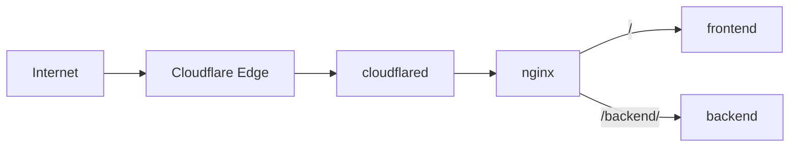

# Cloudflare Tunnel Docker Demo

A small Docker Compose demo that exposes frontend and backend containers through Cloudflare Tunnel and nginx.



Terraform creates the tunnel, public hostname route, and DNS record. Docker Compose runs `cloudflared`, nginx, frontend, and backend.

## Requirements

- Docker, Docker Compose, and Make
- Terraform 1.5 or newer
- A domain managed by Cloudflare

## Setup

1. Open [Cloudflare API Tokens](https://dash.cloudflare.com/profile/api-tokens), then select **Create Token → Custom token → Get started**.

   Add these permissions:

   | Type | Permission | Access |
   | --- | --- | --- |
   | Account | Cloudflare Tunnel | Edit |
   | Account | Access: Apps and Policies | Edit |
   | Account | Access: Organizations, Identity Providers, and Groups | Read |
   | Zone | DNS | Edit |

2. Export the token:

   ```bash
   read -rsp 'Cloudflare API token: ' CLOUDFLARE_API_TOKEN
   export CLOUDFLARE_API_TOKEN
   ```

3. Create `terraform/terraform.tfvars`:

   ```bash
   make setup
   ```

   Find the IDs in the Cloudflare dashboard:

   | ID | Direct location | Action |
   | --- | --- | --- |
   | Account ID | [Account Home](https://dash.cloudflare.com/?to=%2F%3Aaccount%2Fhome) | Press `Ctrl/Cmd + K`, search `Copy account ID`, then select it |
   | Zone ID | [Domains](https://dash.cloudflare.com/?to=%2F%3Aaccount%2Fdomains%2Foverview) | Select your domain, then copy **Zone ID** from **Overview → API** |

   Edit `terraform/terraform.tfvars`:

   ```hcl
   cloudflare_account_id = "your-account-id"
   cloudflare_zone_id    = "your-zone-id"
   hostname              = "demo.example.com"

   enable_access         = true
   access_allowed_emails = ["friend@example.com"]
   ```

   - `enable_access = true`: listed emails sign in with the account's existing one-time PIN.
   - `enable_access = false`: the hostname is public.

   If needed, enable [One-time PIN](https://developers.cloudflare.com/cloudflare-one/integrations/identity-providers/one-time-pin/) under **Zero Trust → Integrations → Identity providers**.

   Use a new hostname. Terraform does not automatically import resources created in the dashboard.

4. Preview and deploy:

   ```bash
   make plan
   make deploy
   ```

Open the hostname you configured. Run `make logs` if you need to inspect the containers.

## Stop or remove

```bash
make down     # Stop containers; keep Cloudflare resources.
make destroy  # Stop containers and delete Cloudflare resources.
```

Export `CLOUDFLARE_API_TOKEN` again before `make destroy` if you opened a new shell.

Terraform state contains the tunnel token. The repository ignores state, `.env`, and `terraform.tfvars`; do not commit them.

## Routing

| Path | Result |
|------|--------|
| `/` | Frontend |
| `/backend` | Redirect to `/backend/` |
| `/backend/*` | Backend (prefix removed) |
